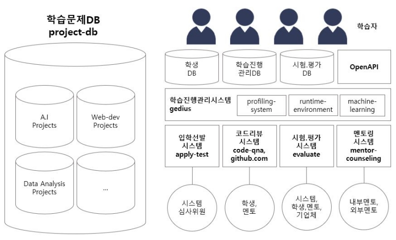
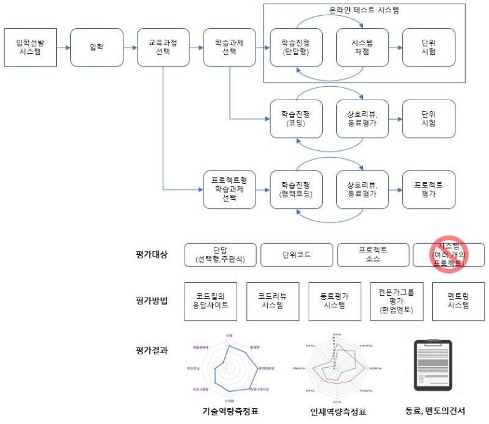

# Open Source Projects of the Innovation Academy
이노베이션 아카데미 재단이 운영하는 "오픈소스 프로젝트" 페이지에 오신 걸 환영합니다. 
각 프로젝트는 누구나 자유롭게 참여할 수 있고, 누구나 자유롭게 사용할 수 있습니다. 

## Direction
"오픈소스 프로젝트"의 목표는 "소프트웨어 인재양성"에 도움이 되는 것입니다. 

- 소프트웨어 산업은 세상의 문제를 능동적으로 분석, 이해한 후 기술을 통해 변화시키는 분야입니다. 

- 소프트웨어 기술은 변화가 많고 발전속도가 빨라, 스스로 정보를 찾고 이해하지 않으면 적응할 수 없습니다.  
- 소프트웨어 코딩은 기술수련의 영역이라 "지식의 축적"만으로 충분하지 않고, "숙련" 이 되어야만 학습이 되었다고 말합니다. 
- 소프트웨어 제품은 단순한 모습에서 복잡한 모습까지 다양하며, 복잡한 제품을 만들기 위해서는 "팀으로 일하는 것"이 필수적입니다. 
- 그래서 소프트웨어 개발자가 된다는 건, 문제를 분석하는 눈, 숙련된 기술, 함께 일할 팀을 얻게 된다는 것입니다. 

## Project-X v0.01
  

컨셉은 "소셜코딩"을 활용한 "프로젝트기반의 소프트웨어 학습시스템" 입니다. 
이 프로젝트에는 세부구상 단계에 있으며, 여러개의 단위시스템으로 구성될 예정입니다. 

- apply-test : 입학선발 시스템
- project-db : 학습을 진행하기 위한 과제별 문제집 DB
- gedius : 학습 진행관리 시스템
- rumtime-environment : 문제풀이 코드를 실행하기 위한 환경
- github.com : 개발한 코드를 리뷰받기 위해 저장하는 Open Repostory
- evaluate : 과제수행여부와 결과를 평가하는 시스템
- code-qna : 작성된 코드에 의견을 달고, 평가하는 시스템
- mentor-counseling : 멘토와 상담하는 시스템
- profiling-system : 학습결과를 기반으로 학습자의 역량을 프로파일링하는 시스템
- machine-learning : 평가지수의 현실성을 높이기 위해 평자가의 경향성을 보정하는 시스템 

### User Scenario
  

#### Scenrio.1
- 나는 Project-X를 통해 "프론트엔드 개발자"과정을 밟고 있다. 
- 나는 저녁식사를 하고 컴퓨터 앞에 앉았다. 
- 웹사이트에 열어 접속하면 지금 함께 공부하는 친구들을 만날 수 있다. 
- 제일 먼저 code-qna 페이지를 열었다. 
- 어제 올라온 질문들을 재빨리 흝어보곤, 쉬운 질문들엔 간단한 대답을 달았다. 
- 이렇게 "내공"을 모아야 다음 과정을 열수 있기 때문에 소홀히 할 수 없는 일이다.

#### Scenario.2
- 오늘은 두근거리는 날이다. 두번째 Chapter를 열기 때문이다. 
- 각 Chapter는 3~8개 정도의 단위문제로 구성되어 있는데, 각 문제마다 공부해야할 링크가 url로 걸려있다. 
- 하지만, 이 내용만으론 공부하기 충분하지 않아서 꼭 구글링을 해야만 한다. 
- 그리고 랜선친구들이 있기 때문에 모르면 물어볼 수 있다.

#### Scenario.3
- 요즘 SNS서비스를 하나 만들 구상인데 Feed를 만들어야 한다. 
- 이 Chapter를 선택한 이유는, Twitter Feed 기능 정도를 구현할 수 있다고 했기 때문이다. 
- 과정을 마치고 나니 현장시스템을 간접적으로 이해할 수 있었고, 교육중에 구현한 코드를 뼈대로 사용할 수 있었다.

#### Scenario.4
- 하나의 Chapter는 학습주제와 목표효과, 이를 통해 획득되는 역량과 스킬이 명확히 정의되어 있다. 
- 그 스킬과 역량은 문제분석, 추적, 커뮤니케이션 스킬 속에서 획득되어 진다.

... (작성중) ...

### Project Type
 

#### 기초학습
- 컴퓨터이론 : 소프트웨어가 구동하는 하드웨어, OS, 네트워크에 대한 이해, 컴퓨터를 움직이는 알고리즘 등 
- 개발플랫폼 : 소프트웨어 플랫폼이 어떤 원리로 동작하는지에 대한 이해
- 언어학습 : 언어의 문법을 손에 익혀보는 단계
- 프로그래밍 학습 : 간단한 프로그램을 짜보는 것
- 프로젝트 학습 : 2 ~ 3인이서 여러개의 프로그램이 합쳐진 하나의 프로젝트를 완성해보는 것

#### 실전학습
- 복잡한 프로젝트 학습 : 덩치가 꽤 큰 프로그램들로 이루어진 하나의 프로젝트를 완성해보는 것
- 성능. 보안학습 : 성능개선을 위한 분산처리, 보안환경을 위한 특별한 환경을 구성해보고 완성해보는 것
- 아키텍쳐 학습 : 여러 시스템 및 소프트웨어 아키텍쳐를 공부하고, 이를 학습하기 위한 프로젝트를 해보는 것
- 도메인 기술지식 : 산업분야별로 상이한 기술환경을 이해하고 학습하기 위한 프로젝트를 해보는 것.